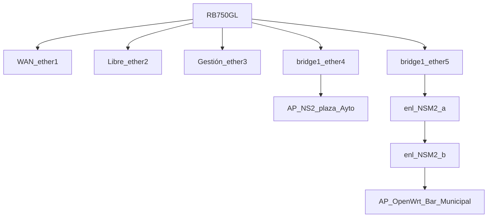

Y se puso en producción el hotspot, un hotspot en wifi es un dispositivo con capacidades de enrutamiento que gestiona conexiones de otros dispositivos (punto caliente) y les da salida a internet, una especie de pasarela o gateway pero en este caso con capacidades de gestión del trafico.
La salida a internet la dona el excelentísimo Ayto de Cepeda la Mora, es un router 4G de 10 Mb dedicado.
<!--more-->
## Mikrotik
Para hacer la gestión de los dispositivos que se conectan a pie de calle se usa una ROUTERBOARD MIKROTIK RB750GL, este router está dedicado solo para esta tarea, lleva funcionando 24x7 desde año 2014 de la era pre-covid.

La red de captación del hotspot va toda en 2.4 Ghz, APs en 802.11b para que se puedan conectar dispositivos antiguos:

## Configuración
``` bash
[admin@hostname] > export 
# mar/14/2021 01:23:15 by RouterOS 6.43.2
# software id = LVV0-IUW2
#
# model = 750GL
# serial number = 467A025857A0
/interface bridge
add comment=LAN fast-forward=no mtu=1500 name=bridge1 protocol-mode=none
/interface ethernet
set [ find default-name=ether1 ] comment="WAN ether1" name=Lan speed=100Mbps
set [ find default-name=ether2 ] speed=100Mbps
set [ find default-name=ether3 ] comment=GESTION speed=100Mbps
set [ find default-name=ether4 ] comment=-AP-HOSTSPOT disabled=yes speed=100Mbps
set [ find default-name=ether5 ] comment=-HS_NANO_ENL speed=100Mbps
/interface list
add name=mactel
add name=mac-winbox
/interface wireless security-profiles
set [ find default=yes ] supplicant-identity=hostname
/ip firewall layer7-protocol
add name=youtube regexp="(GET \\/videoplayback\\\?|GET \\/crossdomain\\.xml)"
add name=torrentsites regexp="^.*(get|GET).+(torrent|thepiratebay|isohunt|entertane|demonoid|btjunkie|mininova|flixflux|torrentz|vertor|h33t|btscene|bitunity|bittoxic|thunderbytes|entertane|zoozle|vcdq|bitnova|bitsoup|meganova|fulldls|btbot|flixflux|\
    seedpeer|fenopy|gpirate|commonbits).*\$"
add name=p2p_www regexp="^.*(get|GET).+(torrent|thepiratebay|isohunt|entertane|demonoid|btjunkie|mininova|flixflux|vertor|h33t|zoozle|bitnova|bitsoup|meganova|fulldls|btbot|fenopy|gpirate|commonbits).*\$"
add name=p2p_dns regexp="^.+(torrent|thepiratebay|isohunt|entertane|demonoid|btjunkie|mininova|flixflux|vertor|h33t|zoozle|bitnova|bitsoup|meganova|fulldls|btbot|fenopy|gpirate|commonbits).*\$"
/ip hotspot profile
add dns-name=guifi.net_Acceso_Abierto hotspot-address=192.168.100.1 login-by=http-chap,trial name=hsprof2 trial-uptime-limit=2d trial-uptime-reset=23h59m
/ip hotspot
add interface=bridge1 name=hotspot1 profile=hsprof2
/ip hotspot user profile
set [ find default=yes ] add-mac-cookie=no keepalive-timeout=none name=usuarios on-login="#Keep alive para limitar la sesion diaria a un tiempo" open-status-page=http-login rate-limit="1M/1M 2M/2M 320k/320k 8/8 1 320/320" shared-users=1000 \
    transparent-proxy=yes
/ip ipsec proposal
set [ find default=yes ] enc-algorithms=3des
/ip pool
add name=hs-pool-4 ranges=192.168.100.10-192.168.100.254
add name=pool_gestion ranges=192.168.88.100-192.168.88.200
/ip dhcp-server
add add-arp=yes address-pool=hs-pool-4 authoritative=after-2sec-delay disabled=no interface=bridge1 lease-time=1d name=dhcp_HS
add add-arp=yes address-pool=pool_gestion disabled=no interface=ether3 name=dhcp_gestion
/ip hotspot user profile
add address-pool=hs-pool-4 name=sincontrol transparent-proxy=yes
/queue simple
add burst-limit=3M/3M burst-threshold=256k/256k burst-time=8s/8s disabled=yes max-limit=2M/2M name=queue1 packet-marks=clientes_2M target=ether4
/queue tree
add disabled=yes name=cliente_2M_up packet-mark=clientes_2M parent=ether4 priority=1
add disabled=yes name=cliente_2M_down packet-mark=clientes_2M parent=ether4 priority=1
add max-limit=5M name=Download parent=bridge1 priority=1
add max-limit=300k name=Upload parent=Lan priority=1
/queue type
add kind=pcq name=PCQ_download_2mb pcq-classifier=dst-address pcq-rate=2M
add kind=pcq name=PCQ_upload_300k pcq-classifier=src-address pcq-rate=300k
add kind=sfq name=BAJADA
add kind=sfq name=SUBIDA
/queue simple
add comment="# l\EDmite global (compartido por todos los usuarios):\r\
    \n# 5M subida\r\
    \n# 35M bajada\r\
    \n# \r\
    \n# segmento de red de los clientes con este paquete de datos,\r\
    \n# puede usarse una interfaz de ser necesario:\r\
    \n# 10.10.12.0/24" limit-at=384k/5M max-limit=384k/5M name=2MB_down_384MB_up queue=PCQ_upload_300k/PCQ_download_2mb target=bridge1 total-queue=default
/queue tree
add disabled=yes max-limit=32k name=P2P packet-mark=p2p-qos parent=bridge1 queue=default
add comment="una cola para el total del tr\E1fico de bajada, aqu\ED se especifica\r\
    \n# la interfaz desde la que se reparte el tr\E1fico a los clientes" disabled=yes limit-at=8M max-limit=8M name="Total download" parent=bridge1 priority=1 queue=default
add comment="una cola para el total del tr\E1fico de subida, aqu\ED se especifica\r\
    \n# la interfaz desde la que se env\EDa el tr\E1fico al gateway " disabled=yes limit-at=300k max-limit=300k name="Total upload" parent=Lan priority=1 queue=default
add comment="hoja (cola hija) de bajada para el tr\E1fico web (HTTP), utiliza\r\
    \n# la marca establecida en la tabla mangle del firewall" disabled=yes limit-at=1M max-limit=6M name=HTTP_D packet-mark=priority_packet parent="Total download" priority=3 queue=default
add comment="hoja de subida para el tr\E1fico web (HTTP), utiliza la misma marca\r\
    \n# de la cola anterior" disabled=yes limit-at=100k max-limit=200k name=HTTP_U packet-mark=priority_packet parent="Total upload" priority=3 queue=default
add comment="los paquetes con marca \"other-internet\" tienen una menor prioridad\r\
    \n# que los paquetes web, es necesario especificar estas colas, de lo\r\
    \n# contrario el tr\E1fico no gestionado pasar\E1 con la mayor prioridad" disabled=yes limit-at=500k max-limit=1M name=OTHER_D packet-mark=no_priority_packet parent="Total download" priority=4 queue=default
add comment="los paquetes con marca \"other-internet\" tienen una menor prioridad\r\
    \n# que los paquetes web, es necesario especificar estas colas, de lo\r\
    \n# contrario el tr\E1fico no gestionado pasar\E1 con la mayor prioridad" disabled=yes limit-at=50k max-limit=100k name=OTHER_U packet-mark=no_priority_packet parent="Total upload" priority=4 queue=default
add name=PRIO1 packet-mark="PRIO 1" parent=Download priority=1 queue=BAJADA
add name=PRIO2 packet-mark="PRIO 2" parent=Download priority=2 queue=BAJADA
add name=PRIO3 packet-mark="PRIO 3" parent=Download priority=3 queue=BAJADA
add name=PRIO4 packet-mark="PRIO 4" parent=Download priority=4 queue=BAJADA
add name=PRIO5 packet-mark="PRIO 5" parent=Download priority=5 queue=BAJADA
add name=PRIO7 packet-mark="PRIO 7" parent=Download priority=7 queue=BAJADA
add name=PRIO8 packet-mark="PRIO 8" parent=Download queue=BAJADA
add name=PRIO.1 packet-mark="PRIO 1" parent=Upload priority=1 queue=SUBIDA
add name=PRIO.2 packet-mark="PRIO 2" parent=Upload priority=2 queue=SUBIDA
add name=PRIO.3 packet-mark="PRIO 3" parent=Upload priority=3 queue=SUBIDA
add name=PRIO.4 packet-mark="PRIO 4" parent=Upload priority=4 queue=SUBIDA
add name=PRIO.5 packet-mark="PRIO 5" parent=Upload priority=5 queue=SUBIDA
add name=PRIO.7 packet-mark="PRIO 7" parent=Upload priority=7 queue=SUBIDA
add name=PRIO.8 packet-mark="PRIO 8" parent=Upload queue=SUBIDA
/snmp community
set [ find default=yes ] addresses=0.0.0.0/0
/system logging action
set 0 memory-lines=100
set 1 disk-lines-per-file=100
set 3 remote=192.168.1.213
/interface bridge port
add bridge=bridge1 hw=no interface=ether4
add bridge=bridge1 hw=no interface=ether5
/interface bridge settings
set use-ip-firewall=yes
/interface list member
add interface=ether2 list=mactel
add interface=ether3 list=mactel
add interface=ether2 list=mac-winbox
add interface=ether4 list=mactel
add interface=ether3 list=mac-winbox
add interface=ether5 list=mactel
add interface=ether4 list=mac-winbox
add interface=ether5 list=mac-winbox
/ip address
add address=10.228.150.3/28 comment="GW Ayto" interface=Lan network=10.228.150.0
add address=192.168.100.1/24 comment="GW hotspot" interface=bridge1 network=192.168.100.0
add address=192.168.88.1/24 interface=ether3 network=192.168.88.0
/ip dhcp-server network
add address=192.168.88.0/24 comment="default configuration" gateway=192.168.88.1
add address=192.168.100.0/24 gateway=192.168.100.1
/ip dns
set allow-remote-requests=yes cache-size=10096KiB max-udp-packet-size=512 servers=10.228.150.6,8.8.4.4
/ip firewall address-list
add list=Syn_Flooder
add disabled=yes list=spammers
add disabled=yes list=support
add address=192.168.100.0/24 list=Cliente_2M
add address=10.228.150.0/28 list=guifi.net
/ip firewall filter
add action=accept chain=input comment="Accept to established connections" connection-state=established
add action=accept chain=input comment="Accept to related connections" connection-state=related
add action=drop chain=forward comment="Filtra paquetes chungos" connection-state=invalid
add action=passthrough chain=unused-hs-chain comment="place hotspot rules here ----------- place hotspot rules here ----------- place hotspot rules here ----------- place hotspot rules here ----------- place hotspot rules here ----------- place hotsp\
    ot rules here ----------- place hotspot rules here ----------- "
add action=jump chain=output comment="Jump for icmp output" disabled=yes jump-target=ICMP protocol=icmp
add action=add-src-to-address-list address-list=Syn_Flooder address-list-timeout=30m chain=input comment="Add Syn Flood IP to the list" connection-limit=30,32 protocol=tcp tcp-flags=syn
add action=drop chain=input comment="Drop to syn flood list" src-address-list=Syn_Flooder
add action=drop chain=input comment="Drop to syn flood list" disabled=yes src-address-list=Syn_Flooder
add action=add-src-to-address-list address-list="port scanners" address-list-timeout=2w chain=input comment="Port scanners to list " protocol=tcp psd=21,3s,3,1
add action=log chain=input comment="Port Scanner Detect LOG" log-prefix="PORT SCAN" protocol=tcp psd=21,3s,3,1
add action=log chain=input comment="Port Scanner Detect LOG" disabled=yes log-prefix="PORT SCAN" protocol=tcp psd=21,3s,3,1
add action=add-src-to-address-list address-list="port scanners" address-list-timeout=2w chain=input comment="NMAP FIN Stealth scan" protocol=tcp tcp-flags=fin,!syn,!rst,!psh,!ack,!urg
add action=add-src-to-address-list address-list="port scanners" address-list-timeout=2w chain=input comment="SYN/FIN scan" protocol=tcp tcp-flags=fin,syn
add action=add-src-to-address-list address-list="port scanners" address-list-timeout=2w chain=input comment="SYN/RST scan" protocol=tcp tcp-flags=syn,rst
add action=add-src-to-address-list address-list="port scanners" address-list-timeout=2w chain=input comment="SYN/FIN scan" protocol=tcp tcp-flags=fin,syn
add action=add-src-to-address-list address-list="port scanners" address-list-timeout=2w chain=input comment="SYN/RST scan" protocol=tcp tcp-flags=syn,rst
add action=add-src-to-address-list address-list="port scanners" address-list-timeout=2w chain=input comment="FIN/PSH/URG scan" protocol=tcp tcp-flags=fin,psh,urg,!syn,!rst,!ack
add action=add-src-to-address-list address-list="port scanners" address-list-timeout=2w chain=input comment="FIN/PSH/URG scan" protocol=tcp tcp-flags=fin,psh,urg,!syn,!rst,!ack
add action=add-src-to-address-list address-list="port scanners" address-list-timeout=2w chain=input comment="ALL/ALL scan" protocol=tcp tcp-flags=fin,syn,rst,psh,ack,urg
add action=add-src-to-address-list address-list="port scanners" address-list-timeout=2w chain=input comment="NMAP NULL scan" protocol=tcp tcp-flags=!fin,!syn,!rst,!psh,!ack,!urg
add action=add-src-to-address-list address-list="port scanners" address-list-timeout=2w chain=input comment="NMAP FIN Stealth scan" protocol=tcp tcp-flags=fin,!syn,!rst,!psh,!ack,!urg
add action=log chain=input comment="Port Scanner Detect LOG" log-prefix="PORT SCAN" protocol=tcp tcp-flags=fin,syn,rst,psh,ack,urg
add action=add-src-to-address-list address-list=Port_Scanner address-list-timeout=1w chain=input comment="Port Scanner Detect" protocol=tcp psd=21,3s,3,1
add action=drop chain=input comment="dropping port scanners" src-address-list="port scanners"
add action=jump chain=input comment="Jump for icmp input flow" disabled=yes jump-target=ICMP protocol=icmp
add action=jump chain=forward comment="Jump for icmp forward flow" disabled=yes jump-target=ICMP protocol=icmp
add action=drop chain=input comment="drop ftp brute forcers" dst-port=21 protocol=tcp src-address-list=ftp_blacklist
add action=drop chain=input comment="drop ssh brute forcers" dst-port=22 protocol=tcp src-address-list=ssh_blacklist
add action=add-src-to-address-list address-list=ssh_blacklist address-list-timeout=1w3d chain=input connection-state=new dst-port=22 protocol=tcp src-address-list=ssh_stage3
add action=add-src-to-address-list address-list=ssh_stage3 address-list-timeout=1m chain=input connection-state=new dst-port=22 protocol=tcp src-address-list=ssh_stage2
add action=add-src-to-address-list address-list=ssh_stage2 address-list-timeout=1m chain=input connection-state=new dst-port=22 protocol=tcp src-address-list=ssh_stage1
add action=add-src-to-address-list address-list=ssh_stage1 address-list-timeout=1m chain=input connection-state=new dst-port=22 protocol=tcp
add action=drop chain=forward comment="drop ssh brute downstream" dst-port=22 protocol=tcp src-address-list=ssh_blacklist
add action=drop chain=ICMP comment="Drop to the other ICMPs" disabled=yes protocol=icmp
add action=drop chain=forward comment="Drop to bogon list" dst-address-list=bogons
add action=add-src-to-address-list address-list=spammers address-list-timeout=3h chain=forward comment="Add Spammers to the list for 3 hours" connection-limit=30,32 dst-port=25,587 limit=30/1m,0 protocol=tcp
add action=add-src-to-address-list address-list="port scanners" address-list-timeout=2w chain=input comment="ALL/ALL scan" protocol=tcp tcp-flags=fin,syn,rst,psh,ack,urg
add action=add-src-to-address-list address-list="port scanners" address-list-timeout=2w chain=input comment="NMAP NULL scan" protocol=tcp tcp-flags=!fin,!syn,!rst,!psh,!ack,!urg
add action=add-src-to-address-list address-list=Syn_Flooder address-list-timeout=30m chain=input comment="Add Syn Flood IP to the list" connection-limit=30,32 protocol=tcp tcp-flags=syn
add action=add-src-to-address-list address-list="port scanners" address-list-timeout=2w chain=input comment="Port scanners to list " protocol=tcp psd=21,3s,3,1
add action=drop chain=forward comment="DENIEGO ICMP" disabled=yes protocol=icmp
add action=accept chain=input comment="Accept DNS - UDP" port=53 protocol=udp
add action=accept chain=input comment="Accept DNS - TCP" port=53 protocol=tcp
add action=accept chain=forward comment="ACEPTAR FTP " connection-state=established connection-type=ftp protocol=0
add action=accept chain=input comment="Full access to SUPPORT address list" src-address-list=support
add action=accept chain=ICMP comment="Echo request - Avoiding Ping Flood" icmp-options=8:0 limit=1,5 protocol=icmp
add action=accept chain=ICMP comment="Echo reply" icmp-options=0:0 protocol=icmp
add action=accept chain=ICMP comment="Time Exceeded" icmp-options=11:0 protocol=icmp
add action=accept chain=ICMP comment="Destination unreachable" icmp-options=3:0-1 protocol=icmp
add action=accept chain=ICMP comment=PMTUD icmp-options=3:4 protocol=icmp
add action=drop chain=ICMP comment="Drop to the other ICMPs" disabled=yes protocol=icmp
add action=log chain=input log-prefix="PING DENEGADO" protocol=icmp
add action=drop chain=virus comment="VIRUS DE WINDOWS" dst-port=135-139,445 protocol=tcp
add action=log chain=virus comment="LOG VIRUS DE WINDOWS" dst-port=135-139,445 log-prefix="VIRUS WINDOWS" protocol=tcp
add action=jump chain=input jump-target=virus
add action=drop chain=input comment="Bloqueo DNS cache externo" dst-port=53 protocol=udp
add action=drop chain=forward comment="Todo P2P" connection-mark=p2p-conn disabled=yes
add action=drop chain=input comment="DROP INPUT P2P" connection-mark=p2p-conn disabled=yes
add action=drop chain=input comment="DROP OUTPUT P2P" connection-mark=p2p-conn disabled=yes
add action=drop chain=input comment="corta ping packetes de 99 bytes a m\E1s." packet-size=128-65535 protocol=icmp
add action=log chain=input log-prefix="PING DENEGADO" protocol=icmp
add action=drop chain=input comment="corta ping" disabled=yes protocol=icmp src-address-list=!guifi.net
add action=add-src-to-address-list address-list="IP's totales" address-list-timeout=none-dynamic chain=forward disabled=yes src-address=192.168.0.0/16
add action=add-src-to-address-list address-list=acceso-winbox address-list-timeout=none-dynamic chain=input dst-port=8291 protocol=tcp
add action=add-src-to-address-list address-list=Port_Scanner address-list-timeout=1w chain=input comment="Port Scanner Detect PUEDE LLEGAR A CERRAR EL PUERTO FPT SI HAY MUCHA ACTIVIDAD, LO PONE EN LA LISTA COMO SCANER DE PUERTOS " protocol=tcp psd=\
    21,3s,3,1
add action=drop chain=forward comment="Drop to bogon list" dst-address-list=bogons
add action=add-src-to-address-list address-list=spammers address-list-timeout=3h chain=forward comment="Add Spammers to the list for 3 hours" connection-limit=30,32 dst-port=25,587 limit=30/1m,0 protocol=tcp
add action=drop chain=forward comment="Avoid spammers action" dst-port=25,587 protocol=tcp src-address-list=spammers
add action=drop chain=forward comment="Limitar Numero de conexiones UDP por cliente" connection-state=new disabled=yes dst-port=!53,67,123 limit=30,40:packet protocol=udp
add action=drop chain=forward comment="default configuration" disabled=yes protocol=icmp
add action=accept chain=input comment="default configuration" connection-state=related disabled=yes
add action=accept chain=input comment="default configuration" connection-state=established disabled=yes
add action=drop chain=input comment="default configuration" disabled=yes in-interface=Lan
add action=accept chain=input comment="DENIEGO ICMP" disabled=yes protocol=icmp
add action=accept chain=forward comment="Reglas Firewall Basicas" connection-state=related
add action=accept chain=forward connection-state=established
add action=drop chain=input comment="FIltra ICMP Redirect" icmp-options=5:0-255 protocol=icmp
add action=log chain=input comment="Port Scanner Detect LOG" log-prefix="PORT SCAN" protocol=tcp tcp-flags=fin,!syn,!rst,!psh,!ack,!urg
add action=log chain=input comment="Port Scanner Detect LOG" log-prefix="PORT SCAN" protocol=tcp tcp-flags=fin,syn,rst,psh,ack,urg,!syn,!rst,!ack,!urg
add action=accept chain=output content="530 Login incorrect" dst-limit=1/1m,9,dst-address/1m protocol=tcp
add action=add-dst-to-address-list address-list=ftp_blacklist address-list-timeout=3h chain=output content="530 Login incorrect" protocol=tcp
add action=jump chain=input comment="Jump for icmp input flow" jump-target=ICMP protocol=icmp
add action=jump chain=forward comment="Jump for icmp forward flow" jump-target=ICMP protocol=icmp
add action=drop chain=input comment="Block all access to the winbox - except to support list # DO NOT ENABLE THIS RULE BEFORE ADD YOUR SUBNET IN THE SUPPORT ADDRESS LIST" disabled=yes dst-port=8291 protocol=tcp src-address-list=!support
add action=drop chain=input comment="Drop anything else! # DO NOT ENABLE THIS RULE BEFORE YOU MAKE SURE ABOUT ALL ACCEPT RULES YOU NEED" disabled=yes
add action=drop chain=input comment="ultimo lugar todo lo que viene de fuera se descarta" disabled=yes in-interface=Lan
add action=drop chain=input comment="Block all access to the winbox - except to support list # DO NOT ENABLE THIS RULE BEFORE ADD YOUR SUBNET IN THE SUPPORT ADDRESS LIST" disabled=yes dst-port=8291 protocol=tcp src-address-list=!support
add action=drop chain=forward disabled=yes p2p=all-p2p
add action=drop chain=forward comment="block p2p_www" layer7-protocol=p2p_www
add action=drop chain=forward comment="block p2p_dns" dst-port=53 layer7-protocol=p2p_dns protocol=udp
add action=add-src-to-address-list address-list=acceso-winbox address-list-timeout=none-dynamic chain=input dst-port=8292 protocol=tcp
/ip firewall mangle
add action=mark-connection chain=prerouting comment="PRIO - 7 MULTIDESCARGAS" connection-bytes=50000000-0 new-connection-mark="PRIO 7" passthrough=yes protocol=tcp
add action=mark-packet chain=prerouting connection-mark="PRIO 7" new-packet-mark="PRIO 7" passthrough=yes
add action=jump chain=prerouting jump-target="TERMINO DE PROCESAR" packet-mark="PRIO 7"
add action=mark-connection chain=prerouting comment="MARCO PRIO 1" new-connection-mark="PRIO 1" passthrough=yes protocol=icmp
add action=mark-connection chain=output dst-port=53 new-connection-mark="PRIO 1" passthrough=yes protocol=udp
add action=mark-connection chain=prerouting dst-port=53 new-connection-mark="PRIO 1" passthrough=yes protocol=udp
add action=mark-packet chain=prerouting connection-mark="PRIO 1" new-packet-mark="PRIO 1" passthrough=yes
add action=jump chain=prerouting jump-target="TERMINO DE PROCESAR" packet-mark="PRIO 1"
add action=mark-connection chain=prerouting comment="MARCO PRIO 2 , STREAMING - JUEGOS,VOIP" dst-port=5060-5061 new-connection-mark="PRIO 2" passthrough=yes protocol=udp
add action=mark-connection chain=prerouting dst-port=1863,5190,777 new-connection-mark="PRIO 2" passthrough=yes protocol=tcp
add action=mark-packet chain=prerouting connection-mark="PRIO 2" new-packet-mark="PRIO 2" passthrough=yes
add action=jump chain=prerouting jump-target="TERMINO DE PROCESAR" packet-mark="PRIO 2"
add action=mark-connection chain=prerouting comment="marco prio 3 navegacion" dst-port=80,443,8000-9000 new-connection-mark="PRIO 3" passthrough=yes protocol=tcp
add action=mark-packet chain=prerouting connection-mark="PRIO 3" new-packet-mark="PRIO 3" passthrough=yes
add action=jump chain=prerouting jump-target="TERMINO DE PROCESAR" packet-mark="PRIO 3"
add action=mark-connection chain=prerouting comment="PRIO 4 - PUERTOS LABORALES" dst-port=25,110,143,3389,1723,21-23 new-connection-mark="PRIO 4" passthrough=yes protocol=tcp
add action=mark-packet chain=prerouting connection-mark="PRIO 4" new-packet-mark="PRIO 4" passthrough=yes
add action=jump chain=prerouting jump-target="TERMINO DE PROCESAR" packet-mark="PRIO 4"
add action=mark-connection chain=prerouting comment="MARCO PRIO 5" new-connection-mark="PRIO 5" passthrough=yes
add action=mark-packet chain=prerouting connection-mark="PRIO 5" new-packet-mark="PRIO 5" passthrough=yes
add action=accept chain="TERMINO DE PROCESAR"
/ip firewall nat
add action=masquerade chain=srcnat comment="default configuration" out-interface=Lan to-addresses=0.0.0.0
/ip firewall service-port
set ftp disabled=yes
set tftp disabled=yes
set irc disabled=yes
set h323 disabled=yes
set sip disabled=yes
set pptp disabled=yes
/ip hotspot ip-binding
...
...
/ip hotspot service-port
set ftp disabled=yes
/ip hotspot user
add name=admin password=password profile=admins server=hotspot1
add name=usuario password=usuario server=hotspot1
add disabled=yes name=usuario@correo.com password=password123 server=hotspot1
/ip hotspot walled-garden
add disabled=yes dst-host=www.google.es server=hotspot1 src-address=0.0.0.0
add comment="place hotspot rules here" disabled=yes
add dst-host=guifi.net
add dst-host=*.guifi.net*/*
add dst-host=gg.google.com
add dst-host=maps.google.com
add dst-host=khm0.google.com
add dst-host=khm1.google.com
add dst-host=khm2.google.com
add dst-host=khm3.google.com
add dst-host=mt0.google.com
add dst-host=mt1.google.com
add dst-host=mt2.google.com
add dst-host=mt3.google.com
add dst-host=maps.gstatic.com
add dst-host=gg.google.com
add dst-host=id.google.com
add dst-host=www.google-analytics.com
add dst-host=www.heywhatsthat.com
add dst-host=ocsp.thawte.com
add dst-host=https://securityinabox.org/es*/*
add dst-host=http://www.eltiempo.es/*
add dst-host=http://elrollodecepeda.wordpress.com/*
add dst-host=http://cepedadelamora.blogspot.com/*
add dst-host=https://llistes.guifi.net/sympa/info/guifi-gredos
add dst-host=https://llistes.guifi.net/*
add dst-host=http*://securityinabox.org/es*/*
add dst-host=https://*llistes.guifi.net*/*
add dst-host=https://llistes.guifi.net/sympa/subscribe/guifi-gredos
add dst-host=https://llistes.guifi.net/sympa*/*
add dst-host=https://llistes.guifi.net/sympa/*
add dst-host=http://bin-short.whatsapp.net/
add dst-host=http://cepedadelamora.blogspot.com.es/
add dst-host=*.qui.guifi.net*/*
/ip hotspot walled-garden ip
add action=accept comment=10.0.0.0/8 disabled=no dst-address=10.0.0.0/8 !dst-port !protocol !src-address
add action=accept comment=llistes.guifi.net disabled=no dst-address=109.69.12.15 !dst-port !protocol !src-address
add action=accept comment=securityinabox.org disabled=no dst-address=88.198.62.144 !dst-port !protocol !src-address
/ip ipsec policy
set 0 dst-address=0.0.0.0/0 src-address=0.0.0.0/0
/ip proxy
set cache-administrator=xxx@gmail.com cache-path=web-proxy1 parent-proxy=0.0.0.0
/ip route
add distance=1 gateway=10.228.150.1
/ip service
set telnet disabled=yes
set ftp address=0.0.0.0/0 disabled=yes
set www address=192.168.1.0/24
set ssh address=0.0.0.0/0 disabled=yes
set www-ssl address=0.0.0.0/0 certificate=cert1 disabled=no
set api disabled=yes
set winbox address=0.0.0.0/0 port=8291
set api-ssl disabled=yes
/ip traffic-flow
set active-flow-timeout=10m cache-entries=64k enabled=yes
/ip traffic-flow target
add dst-address=10.228.150.2 port=5556
/snmp
set contact=guifi@guifi.net enabled=yes location=hostname
/system clock
set time-zone-autodetect=no time-zone-name=Europe/Madrid
/system clock manual
set dst-end="feb/01/1970 00:00:00" dst-start="feb/01/1970 00:00:00"
/system identity
set name=hostname
/system logging
add action=remote topics=critical
add action=remote topics=error
add action=remote topics=info
add action=remote topics=warning
add topics=e-mail
add action=remote topics=e-mail
add action=disk topics=critical
add action=remote topics=firewall
add action=disk topics=system
add action=echo topics=warning
/system note
set note="MMMMMMMMMMMMMMMMMMMMMXo,;:::;,;dXMMMMMMMMMMMMMMMMMMMMMMMMMMMMMMMMMMMMM\
    \nMMMMMMMMMMMMMMMMMMMWO;;OWMMWXo. :KMMMMMWKxoldkXWMMMMMMMMMMMMMMMMMMMMMM\
    \nMMMMMMMMMMMMMMMMMMKc'lXMMMMMMX:  ;KMMMXo;dk'  .cx0KNWMMMMMMMMMMMMMMMMM\
    \nMMMMMMMMMMMMMMMMMO,,OWMMMMMMMWo   ,oxxcc0WWx..'. .,.,dXMMMMMMMMMMMMMMM\
    \nMMMMMMMMMMMMMMMMK;:XMMMMMMMMMMXc..;cokKWMMXkl:clcc,   :XMMMMMMMMMMMMMM\
    \nMMMMMMMMMMMMMMMK:lXMMMMMMMMMMMM0' .:cod0NWd..;,..';,.  oNMMMMMMMMMMMMM\
    \nMMMMMMMMMMMMMXx;oNMMMMMMMMMMMMNOl:;:::cooddl:;,,'  .cl;.;oOKNWMMMMMMMM\
    \nMMMMMMMMMW0olcl0WMMMMMMMMMMMMMWK0NX0OdoooolccloOKkl:dklcc,..,oddKMMMMM\
    \nMMMMMMMMKc':kXWMMMMMMMMMMMMMMMMMMMMMWx;'..:cclllodxolo,.':.  .,..oKWMM\
    \nMMMMMMNd,:0WMMMMMMMMMMMMMMMMMMMMMMNXo.     .cooll;..,codc,. .,',;,':ON\
    \nMMMWXd::kWMMMMMMMMMMMMMMMMMMMMMMMM0l'       ';;:oollc,,dOdl;';clodoolk\
    \nN0kdooONMMMMMMMMMMMMMMMMMMMMMMMMMWd,'..       'loldXNkolllokxookKKXWNK\
    \nXK0XWMMMMMMMMMMMMMMMMMMMMMMMMMMWKOdccoxc.     'dOkOXN0x0XK0NMMMMMMMMMM\
    \nMMMMMMMMMMMMMMMMMMMMMMMMMMMMMMMMKx0MXxdkxl:,::dKWMMWMMMWWMMMMMMMMMMMMM\
    \n"
/system ntp client
set enabled=yes primary-ntp=158.227.98.15 secondary-ntp=193.136.164.1
/system ntp server
set enabled=yes multicast=yes
/system routerboard settings
set silent-boot=no
/system scheduler
add comment=23:42:26 interval=23h54m name=LOG_MAIL on-event=":local scheduleName \"LOG_MAIL\"\r\
    \n:local emailAddress \"mail@gmail.com\"\r\
    \n:local startBuf [:toarray [/log find message~\"logged in\" || message~\"login failure\"]]\r\
    \n:local removeThese (\"\")\r\
    \n \r\
    \n:local lastTime [/system scheduler get [find name=\"\$scheduleName\"] comment]\r\
    \n \r\
    \n:local currentBuf \"\"; :set currentBuf [:toarray \$currentBuf]\r\
    \n \r\
    \n:foreach i in=\$startBuf do={\r\
    \n  :local toggle 1\r\
    \n  :foreach j in=[:toarray \$removeThese] do={\r\
    \n    :if ([:typeof [:find [/log get \$i message] \"\$j\"]] = \"num\") do={\r\
    \n      :set toggle 0\r\
    \n    }\r\
    \n  }\r\
    \n  :if (\$toggle = 1) do={\r\
    \n    :set currentBuf (\$currentBuf , \$i)\r\
    \n  }\r\
    \n}\r\
    \n \r\
    \n:local currentLineCount [ :len \$currentBuf ]\r\
    \n  \r\
    \nif (\$currentLineCount > 0) do={\r\
    \n   :local currentTime \"\$[ /log get [ :pick \$currentBuf (\$currentLineCount -1) ] time ]\"\r\
    \n  \r\
    \n   :if ([:len \$currentTime] = 15 ) do={\r\
    \n      :set currentTime [ :pick \$currentTime 7 15 ]\r\
    \n   }\r\
    \n     \r\
    \n   :local output \"\$currentTime \$[/log get [ :pick \$currentBuf (\$currentLineCount-1) ] message ]\"\r\
    \n     \r\
    \n   :if (([:len \$lastTime] < 1) || (([:len \$lastTime] > 0) && (\$lastTime != \$currentTime))) do={\r\
    \n      /system scheduler set [find name=\"\$scheduleName\"] comment=\$currentTime\r\
    \n      /tool e-mail send to=\"mail@gmail.com\" port=25 server=74.125.133.108 user=mail@gmail.com password=password from=hostname start-tls=yes subject=\"hostname_LOG \$currentTime\" body=\"\$output\"\r\
    \n   }\r\
    \n}" policy=ftp,reboot,read,write,policy,test,password,sniff,sensitive start-time=startup
add interval=23h53m name=SEND_BACKUP on-event="/system script run SEND_BACKUP" policy=ftp,reboot,read,write,policy,test,password,sniff,sensitive start-time=startup
add comment="REINICIO CADA DIA" interval=1d name=schedule1 on-event="/system script run reiniciar" policy=ftp,reboot,read,write,policy,test,password,sniff,sensitive start-date=jun/03/2016 start-time=06:00:00
/system script
add dont-require-permissions=no name=console_detail owner=admin policy=ftp,reboot,read,write,policy,test,password,sniff,sensitive source=":local content\r\
    \n:local logcontenttemp \"\"\r\
    \n:local logcontent \"\"\r\
    \n:local counter\r\
    \n:local v 0\r\
    \n \r\
    \n:set logcontenttemp \"You are logged into: \$[/system identity get name]\"\r\
    \n:set logcontent (\"\$logcontent\" .\"\$logcontenttemp\" .\"\\n\")\r\
    \n \r\
    \n:set logcontenttemp \"############### system health ###############\"\r\
    \n:set logcontent (\"\$logcontent\" .\"\$logcontenttemp\" .\"\\n\")\r\
    \n \r\
    \n:set logcontenttemp \"Uptime:  \$[/system resource get uptime] d:h:m:s\"\r\
    \n:set logcontent (\"\$logcontent\" .\"\$logcontenttemp\" .\" | \")\r\
    \n \r\
    \n:set logcontenttemp \"CPU: \$[/system resource get cpu-load]%\"\r\
    \n:set logcontent (\"\$logcontent\" .\"\$logcontenttemp\" .\"\\n\")\r\
    \n \r\
    \n:set logcontenttemp \"RAM: \$(([/system resource get total-memory]-[/system resource get free-memory])/1024)/\$([/system resource get total-memory]/1024)M\"\r\
    \n:set logcontent (\"\$logcontent\" .\"\$logcontenttemp\" .\" | \")\r\
    \n \r\
    \n##\r\
    \n#voltage and temp readout not available on x86, check for this before trying\r\
    \n#to record otherwise script will halt unexpectedly\r\
    \n##\r\
    \n \r\
    \n:if ([/system resource get architecture-name]=\"x86\") do={\r\
    \n  :set logcontenttemp \"Voltage: NIL\"\r\
    \n  :set logcontent (\"\$logcontent\" .\"\$logcontenttemp\" .\" | \")\r\
    \n  :set logcontenttemp \"Temp: NIL\"\r\
    \n  :set logcontent (\"\$logcontent\" .\"\$logcontenttemp\" .\"\\n\")\r\
    \n} else={\r\
    \n  :set logcontenttemp \"Voltage: \$[:pick [/system health get voltage] 0 2] v\"\r\
    \n  :set logcontent (\"\$logcontent\" .\"\$logcontenttemp\" .\" | \")\r\
    \n  :set logcontenttemp \"Temp: \$[ /system health get temperature]c\"\r\
    \n  :set logcontent (\"\$logcontent\" .\"\$logcontenttemp\" .\"\\n\")\r\
    \n}\r\
    \n \r\
    \n:set logcontenttemp \"############# user auth details #############\"\r\
    \n:set logcontent (\"\$logcontent\" .\"\$logcontenttemp\" .\"\\n\")\r\
    \n \r\
    \n:foreach counter in=[/ip hotspot active find ] do={:set v (\$v + 1)}\r\
    \n:set logcontenttemp \"Hotspot online: \$v |\"\r\
    \n:set v 0\r\
    \n:foreach counter in=[/ppp active find ] do={:set v (\$v + 1)}\r\
    \n:set logcontenttemp (\"\$logcontenttemp\" . \" PPP online: \$v\")\r\
    \n:set logcontent (\"\$logcontent\" .\"\$logcontenttemp\" .\"\\n\")\r\
    \n \r\
    \n/system note set note=\"\$logcontent\""
add dont-require-permissions=no name=reiniciar owner=admin policy=ftp,reboot,read,write,policy,test,password source="/system reboot"
add dont-require-permissions=no name=SEND_BACKUP owner=admin policy=ftp,reboot,read,write,policy,test,password,sniff,sensitive source="/system backup save name=hostname_email_backup dont-encrypt=no\r\
    \n/log print file=hostname_logmail.txt\r\
    \n\r\
    \n/tool e-mail send file=hostname_email_backup.backup to=mail@gmail.com port=25 server=74.125.133.108 user=mail@gmail.com password=password from=hostname start-tls=yes subject=hostname_backup_diario body=hostname_backup_diario\r\
    \n/tool e-mail send file=hostname_logmail.txt to=mail@gmail.com port=25 server=74.125.133.108 user=mail@gmail.com password=password from=hostname start-tls=yes subject=hostname_log_diario body=hostname_log_diario"
add dont-require-permissions=no name=address_list_winbox-acces owner=admin policy=ftp,reboot,read,write,policy,test,password,sniff,sensitive source="ip firewall address-list print"
/tool e-mail
set address=74.125.133.108 from=hostname password=password start-tls=yes user=mail@gmail.com
/tool graphing interface
add
add interface=bridge1
add
add interface=ether1
add interface=ether3
add interface=ether4
add interface=ether5
add
/tool graphing queue
add simple-queue=2MB_down_384MB_up
add simple-queue=queue1
/tool graphing resource
add
/tool mac-server
set allowed-interface-list=mactel
/tool mac-server mac-winbox
set allowed-interface-list=mac-winbox
/tool romon port
add
*>
```
## Conclusión
Como conclusión os digo, que en este momento se intentan poner todas las facilidades posibles para que a pie de calle se pueda conectar al acceso abierto con cualquier dispositivo que cuente al menos con 802.11b.
Al principio estaba el portal cautivo del hotspot con acceso limitado en tiempo y caudal (creo que eran 320k simétricos para cada dispositivo por un tiempo de 2 horas al día por dispositivo), en esta gestión por MAC, el "cliente" se tenia que abrir una página cualquiera en el navegador del dispositivo y esta le redireccionaba a la página del hotspot, después validarse en el hotspot con un link de pincha aquí para tener acceso, en fin, un lío para cualquiera que quisiera conectarse a la wifi donde me cansé de dar instrucciones.
Hubo un día que me toco las narices y se deshabilitó el hotspot. Ahora para tener conexión a internet basta con conectar a la wifi. Hay un caudal límite para toadas las conexiones de acceso abierto, y el "cliente" cuando se quiere conectar solo tiene que conectar con el SSID del AP, se conecta a una wifi que no tiene contraseña, se asigna una IP y ya le funciona el WhatsApp y cualquier servicio de su dispositivo, antes para que funcionara el WhatsApp primero había que conectase al portal cautivo con el navegador, y no valía la barra de búsqueda de Google que usan muchos usuarios.

La gestión del tráfico en el acceso abierto se hace por QoS se asignan prioridades dependiendo del servicio.
Si tuviéramos 100 o 200 Mb de salida a internet no tendríamos estos problemas y a pié de calle el grifo estaría abierto a demanda, pero la salida a internet es limitada y requiere de gestión por QoS para evitar la congestión.
Lo que tenemos actualmente, en 2021, es un una salida global a internet por telefonía móvil que falla cuando quiere y que hay que repartir entre muchas conexiones. Hay un caudal limitado para el total de conexiones a pie de calle y el resto es para las conexiones residenciales.

El invento funciona más o menos 335 días al año, hay 30 días cuando llegan las temporadas de máxima concurrencia de conexiones que da igual lo que tengas configurado porque la salida a internet es la misma todo el año y no da para más.
Por ejemplo, en verano que son las temporadas de pico máximo, con 30 nodos residenciales a 4 dispositivos de media por nodo son 120 dispositivos residenciales + de 20 a 40 dispositivos del hotspot son 150 dispositivos que tienen que salir a internet por una conexión que está dimensionada para tener de 1 a 4 dispositivos.

Que quede claro que yo no soy partidario hacer gestión del tráfico en ningún sitio y mucho menos en una red comunitaria, pero la salida a internet es la que es y hay momentos en los que hay muchas bocas que alimentar. Son los usuarios los que se tienen que responsabilizar de su uso.
 
Una posible solución a este problema de concurrencia seria aplicar QoS dinámicas en las que se hiciera la gestión del tráfico por prioridad, tiempo y caudal, basándose en el número de conexiones y demanda de cada momento. Esto no sé hacerlo, se admiten sugerencias.
