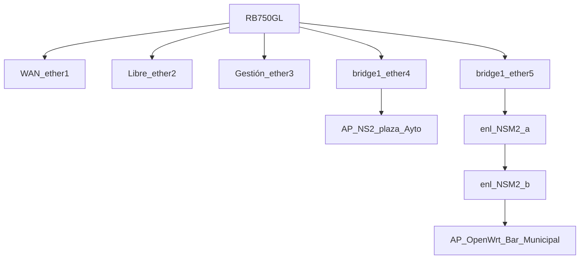

Y se puso en producción el hotspot, un hotspot en wifi es un punto caliente, un dispositivo con capacidades de enrutamiento que gestiona conexiones de otros dispositivos y les da salida a internet, una especie de pasarela o gateway pero en este caso con capacidades de gestión del trafico.
<!--more-->
## Mikrotik
Para hacer la gestión de los dispositivos que se conectan a pie de calle se usa una ROUTERBOARD MIKROTIK RB750GL, este router está dedicado solo para esta tarea, lleva funcionando 24x7 desde año 2014 de la era pre-covid.

La red de captación del hotspot va toda en 2.4 Ghz, APs en 802.11b:


Tener el respaldo de una asociación consolidada dará fuerza al proyecto. Si no hay nada, es muy interesante contemplar la posibilidad de crear una fundación, asociación, cooperativa, grupo o colectivo de usuarios para fomentar la implicación del grupo y para repartir la carga de trabajo. Tomar de decisiones es más fácil cuando no estás solo. Pero también ten en cuenta que si viajas solo, podrás volar a donde quieras y estar el tiempo que te dé la gana.


 